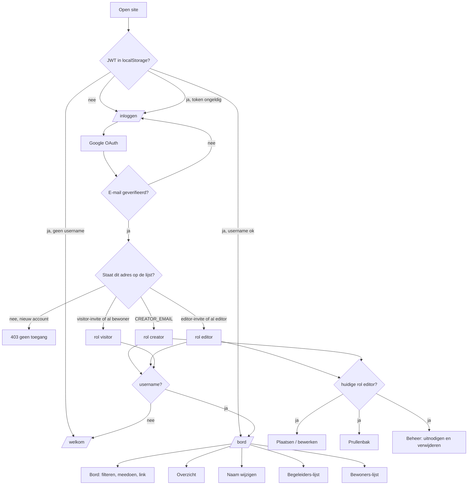
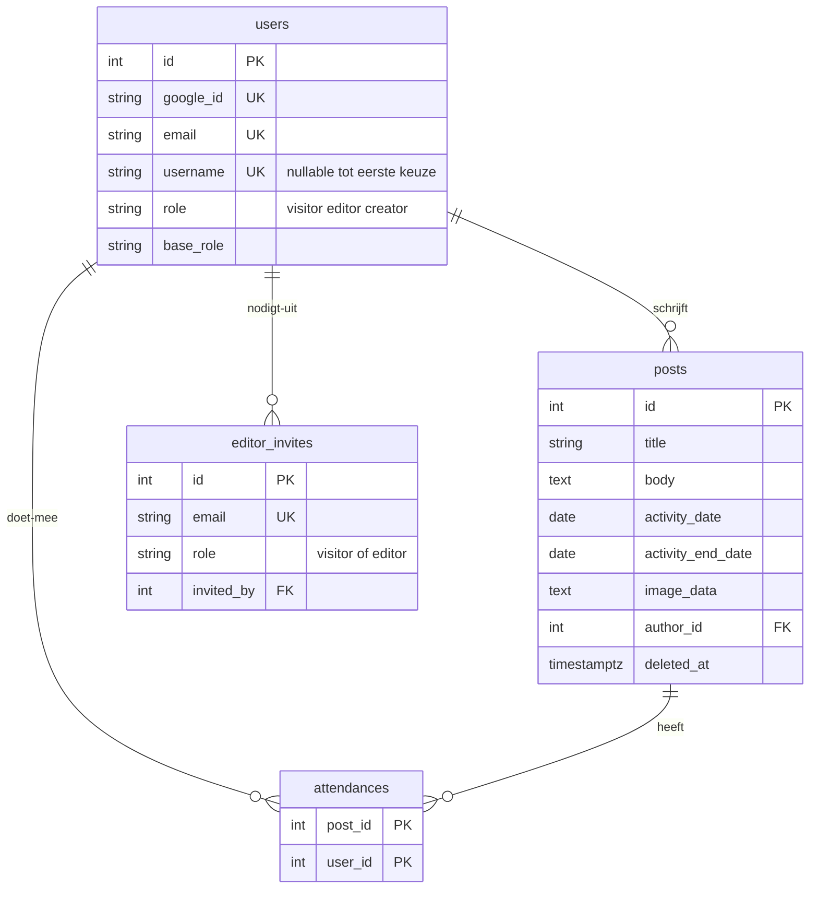
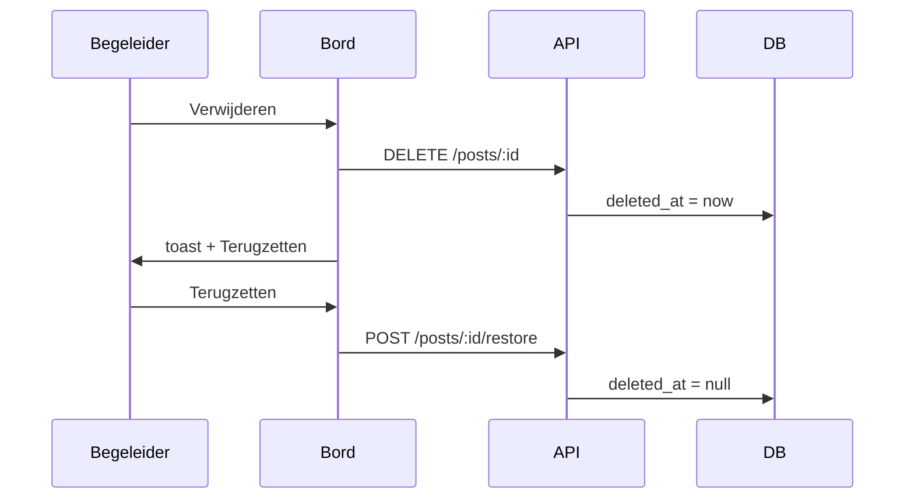

# Leviaan Campus — technische specificatie

Dit bestand beschrijft hoe de app **nu** werkt (code, API, database, schermen). Gebruik het om te controleren of flows, rollen en privacy kloppen.

Live: https://leviaan.vercel.app  
Code: https://github.com/raimonvibe/leviaan  
Huis: https://www.leviaan.nl

Taal van de interface: Nederlands. Geen chat, geen takenlijst, geen publiek social netwerk: alleen het activiteitenbord van één huis.

---

## 1. Hoofdoverzicht van alle flows



| # | Flow | Start | Resultaat |
| --- | --- | --- | --- |
| A | Eerste bezoek | `/inloggen` | Google → alleen als e-mail op de lijst staat → username → bord |
| B | Terugkeren | bestaande JWT | `/bord` (of `/welkom` als naam ontbreekt) |
| C | Beheerder-login | `CREATOR_EMAIL` | altijd `creator` + `base_role=creator` |
| D | Begeleider uitnodigen | Beheer, Google-e-mail | rij in `editor_invites` (`role=editor`) of directe promotie |
| D2 | Bewoner toevoegen | Beheer, Google-e-mail | rij in `editor_invites` (`role=visitor`) |
| E | Uitgenodigde logt in | zelfde Google-e-mail | automatisch `editor` of `visitor` volgens de invite |
| F | Bewoner wordt begeleider | bestaande visitor + editor-invite | `role` en `base_role` → `editor` |
| G | Activiteit plaatsen | `/berichten/nieuw` | kaart op het bord + toast |
| H | Meedoen | vinkje op kaart | rij in `attendances`; namen zichtbaar voor iedereen |
| I | Soft-delete | Verwijderen op bord | `deleted_at` gezet + undo-toast |
| J | Prullenbak | `/prullenbak` | terugzetten of voorgoed wissen (site-dialoog) |
| K | Begeleider/bewoner verwijderen | Beheer | user weg, posts cascade; **nooit de beheerder** |
| L | Kijk-als | knoppen in header / Beheer | tijdelijke `role`; `base_role` blijft |
| M | Naam wijzigen | `/naam` | username in DB + toast |
| N | Licht/donker | zon/maan-toggle | `localStorage leviaan_theme` |
| O | Uitloggen | header | token weg, terug naar login |

Publieke pagina’s (geen login): `/inloggen`, `/privacy`, `/google-account`.  
`/welkom` vereist wel een geldige sessie.

---

## 2. Rollen in één oogopslag

Er zijn drie **echte** rollen in de database. De beheerder is geen “super-editor” via een extra tabel, maar het Google-adres in `CREATOR_EMAIL`.

| Sleutel | Nederlandse naam | `role` / `base_role` | Hoe je het wordt |
| --- | --- | --- | --- |
| Bewoner | Bewoner | `visitor` | e-mail toegevoegd op Beheer + inloggen met **hetzelfde** Google-adres, of bestaand account |
| Begeleider | Begeleider | `editor` | uitnodiging + inloggen met **hetzelfde** Google-e-mailadres, of directe promotie als die persoon al bestaat |
| Beheerder | Beheerder | `creator` | e-mail === `CREATOR_EMAIL` bij elke login |

`role` = wat de sessie **nu** mag (inclusief “kijk als”).  
`base_role` = wat de persoon **echt** is. Bij begeleiders blijft `base_role=editor` ook als ze als bewoner meekijken.

| Actie | Bewoner | Begeleider | Beheerder |
| --- | --- | --- | --- |
| Bord zien, filteren, foto vergroten | ja | ja | ja |
| “Ik doe mee” | ja | ja | ja |
| Namen van wie meedoet zien | ja | ja | ja |
| Lijst begeleiders / bewoners (alleen namen) | ja | ja | ja |
| Eigen naam wijzigen | ja | ja | ja |
| Activiteit plaatsen / bewerken | nee | ja | ja |
| Soft-delete + prullenbak | nee | ja | ja |
| E-mail van bewoner of begeleider toevoegen | nee | ja | ja |
| Begeleider of bewoner van het bord halen | nee | ja | ja |
| Beheerder verwijderen of demoten | nee | nee | nee |
| “Zelf meekijken” als begeleider/bewoner | nee | nee | ja |
| “Kijk als bewoner” | nee | ja | via Zelf meekijken |
| Rechten van een ander wijzigen (`PATCH /editors/:id/role`) | nee | nee | ja (API; UI gebruikt dit niet meer voor demoten) |

**Nooit:** e-mailadressen van anderen tonen op het bord, in overzicht of in de openbare lijsten. Openstaande uitnodigingen tonen wél het ingetikte e-mailadres, alleen op **Beheer**.

Frontend-flags (`AuthContext`):

- `isEditor` = huidige `role` is `editor` **of** `creator`
- `isCreator` = huidige `role` is `creator`
- `isOwner` = e-mail is `CREATOR_EMAIL` (blijft waar, ook tijdens meekijken)
- `canSwitchRole` = `base_role === editor` **of** `isOwner`

Pagina’s onder `/berichten/*`, `/prullenbak` en `/redactie` vereisen `isEditor` (huidige rol). Wie als bewoner meekijkt, ziet die menu’s niet tot die terugschakelt.

---

## 3. Technische stack

| Laag | Keuze |
| --- | --- |
| Frontend | React 19, Vite 6, Tailwind CSS 4, React Router 7, Axios, `@react-oauth/google` |
| Backend | Node ≥ 20, Express 5, `pg`, JWT HS256, `google-auth-library`, Helmet, CORS, express-rate-limit |
| Database | PostgreSQL (Neon). Schema: `backend/src/schema.sql`, toegepast bij elke API-start |
| Hosting | Vercel (Vite-frontend, root `frontend`, output `dist`), Render (API, root `backend`), Neon (directe host, niet `-pooler`) |
| Keep-alive | GitHub Action `.github/workflows/keepalive.yml` pingt `/health` elke 10 minuten |

Geen Docker, geen Kubernetes, geen extra object-storage. Foto’s zijn data-URL’s in Postgres.

### 3.1 Repo-indeling

```
backend/src/main.js          Express, CORS, rate limits, schema-boot
backend/src/db.js            pg Pool, SSL buiten localhost
backend/src/schema.sql       idempotente migraties
backend/src/middleware/auth.js
backend/src/publicUser.js    publieke vs private user, owner-check
backend/src/routes/auth.js
backend/src/routes/posts.js
backend/src/routes/editors.js
backend/src/routes/stats.js
frontend/src/App.jsx
frontend/src/contexts/        Auth, Theme, Toast, Dialog
frontend/src/pages/           schermen
frontend/src/components/      Layout, kaarten, ThemeToggle, …
```

### 3.2 Omgeving (geen geheimen in git)

Backend (`backend/.env`): `PORT`, `NODE_ENV`, `DATABASE_URL`, `JWT_SECRET` (≥ 32 tekens), `GOOGLE_CLIENT_ID`, `FRONTEND_URL` (komma-gescheiden origins toegestaan), `CREATOR_EMAIL`.

Frontend (`frontend/.env`): `VITE_API_URL`, `VITE_GOOGLE_CLIENT_ID`. Vite bakt deze in bij de build; na een Client-ID-wijziging moet Vercel opnieuw deployen.

Productie:

- `FRONTEND_URL` = `https://leviaan.vercel.app` (geen slash)
- `VITE_API_URL` = publieke Render-url (geen slash)
- Neon: **directe** host (`ep-….neon.tech`), `?sslmode=require`
- Google Authorized JavaScript origins: `http://localhost:5173` en `https://leviaan.vercel.app`

### 3.3 Beveiliging (kort)

- JWT in `localStorage` (`leviaan_token`), header `Authorization: Bearer …`
- Token: algoritme HS256, 14 dagen, payload `{ sub: userId, role }` — **autorisatie gebruikt de user uit de database**, niet alleen de JWT-role
- Google: ID-token **of** access-token + userinfo; e-mail moet verified zijn; `aud` moet de Client ID zijn
- Rate limit: 300 req / 15 min algemeen; 20 req / 15 min op `/api/auth/google`
- JSON-body max 2 MB; foto max ~1,8 miljoen tekens, alleen `data:image/(jpeg|jpg|png|webp|gif);base64,…`, geen SVG
- Helmet + CORS allowlist
- Vercel: CSP, `X-Frame-Options: DENY`, geen camera/mic/geo

---

## 4. Datamodel



Regels:

- `users.username`: uniek, optioneel tot `/welkom`
- `posts.author_id` → `ON DELETE CASCADE` (iemand van het bord halen verwijdert diens activiteiten)
- `attendances` en `editor_invites.invited_by`: cascade / `SET NULL`
- Soft-delete: `posts.deleted_at`; prullenbak-legen is echte `DELETE`
- `base_role` is later toegevoegd; bestaande rijen kregen `base_role = role`

---

## 5. Frontend-routes en guards

| Pad | Auth | Extra | Pagina |
| --- | --- | --- | --- |
| `/inloggen` | publiek | ingelogd → `/bord` of `/welkom` | Login |
| `/welkom` | sessie, nog geen naam | anders → `/bord` of `/inloggen` | eerste username |
| `/privacy` | publiek | | Privacy |
| `/google-account` | publiek | | Google-account hulp |
| `/` en `/bord` | ingelogd + username | | Bord |
| `/overzicht` | idem | | tellingen |
| `/begeleiders` | idem | | namen begeleiders |
| `/bewoners` | idem | | namen bewoners |
| `/naam` | idem | | username wijzigen |
| `/redacteuren` | — | redirect naar `/begeleiders` | |
| `/berichten/nieuw` | `isEditor` | anders → `/bord` | nieuw bericht |
| `/berichten/:id/bewerken` | `isEditor` | | bewerken |
| `/prullenbak` | `isEditor` | | trash |
| `/redactie` | `isEditor` | | Beheer |
| `*` | — | → `/` | |

Providers (buitenste → binnenste): GoogleOAuth → Theme → Auth → Dialog → Toast → Router.

---

## 6. Flows uitgewerkt

### A. Eerste bezoek en Google-login

1. Bezoeker opent de site. Geen token → `/inloggen`.
2. Knop **Doorgaan met Google** (`useGoogleLogin`, scope `openid email profile`) geeft een **access token**.
3. Frontend `POST /api/auth/google` met `{ accessToken }` (oude `{ credential }` ID-token blijft werken).
4. Backend haalt Google-profiel op, eist verified e-mail, normaliseert e-mail naar lowercase.
5. Zoekt user op `google_id` **of** `email`.
6. Nieuwe user: alleen als het adres op de lijst staat. `role` en `base_role` via `resolveRole`:
   - e-mail = `CREATOR_EMAIL` → `creator`
   - `editor_invites.role = editor` → `editor`
   - `editor_invites.role = visitor` → `visitor`
   - geen invite en geen bestaand account → **403**, geen user aanmaken
7. Bestaande user (staat al in `users`):
   - `CREATOR_EMAIL` forceert altijd `creator`
   - `base_role === editor` forceert `role` terug naar `editor` (meekijken als bewoner overleeft **herlogin niet**)
   - `visitor` mag via editor-invite alsnog `editor` worden
8. Invite-rij wordt verwijderd na een geslaagde login.
9. JWT + private user terug. Token in `localStorage`.
10. Geen username → `/welkom`. Wel username → `/bord`.

Fouten (inline op de loginpagina, geen OS-popup): Google weigert, te veel pogingen, ongeldige client, e-mail niet op de lijst.

**Te toetsen:** onbekend Google-adres krijgt 403 en geen account; inloggen met het **exacte** Google-adres van de uitnodiging; een ander Gmail-adres van dezelfde persoon wordt geweigerd.

### B. Gebruikersnaam kiezen en wijzigen

- Eerste keer: `/welkom`, 3–24 tekens `[A-Za-z0-9_]`, uniek case-insensitive.
- Later: menu **Naam** of `/naam`. Zelfde regels. Succes → toast *Je naam op het bord is aangepast.*
- E-mail blijft privé; de username is wat huisgenoten zien (bord, meedoen-lijst, begeleiders/bewoners).

**Te toetsen:** botsende namen; naam wijzigen als bewoner én als begeleider.

### C. Begeleider of bewoner toevoegen (Beheer)

Wie: huidige rol `editor` of `creator`. Pagina `/redactie`.

1. Uitleg op de pagina: alleen adressen op deze lijst mogen inloggen. Google-e-mail toevoegen als bewoner of begeleider → inloggen met **hetzelfde** adres.
2. `POST /api/editors/invites` `{ email, role }` met `role` = `visitor` of `editor` (standaard `editor`).
3. Weigeringen:
   - ongeldig e-mail
   - `CREATOR_EMAIL` / bestaande `creator`
   - persoon is al begeleider (`base_role` of `role` = `editor`)
   - `role=visitor` en persoon is al bewoner
   - dezelfde invite bestaat al (`409`)
   - adres staat al open als begeleider en je wilt bewoner toevoegen (`400`)
4. Bestaande **bewoner** + `role=editor`: meteen `role` en `base_role` = `editor`, invite weg, `{ promoted: true }`. Toast: *X is nu begeleider…*
5. Openstaande bewoner-invite + daarna begeleider: invite wordt `editor`, `{ upgraded: true }`.
6. Nog geen account: rij in `editor_invites` met die `role`. Toast volgens bewoner of begeleider.
7. Openstaande invites: e-mail + rol zichtbaar op Beheer; **Intrekken** via site-dialoog, daarna toast.

**Te toetsen:** begeleider voegt bewoner toe; begeleider nodigt tweede begeleider uit; beheerder nodigt uit; uitnodigen van de beheerder faalt; onbekend adres kan niet inloggen; intrekken vóór login.

### D. Automatisch begeleider of bewoner bij inloggen

Drie paden, invite weg na login:

| Situatie | Wat er gebeurt |
| --- | --- |
| Nieuw Google-account, `editor_invites.role = editor` | insert user als `editor` |
| Nieuw Google-account, `editor_invites.role = visitor` | insert user als `visitor` |
| Bestaande bewoner, daarna editor-invite (of invite daarna login) | update naar `editor` |
| Nieuw Google-account, geen invite, geen `CREATOR_EMAIL` | **403**, geen user |

**Te toetsen:** uitnodigen → uitloggen als testdoos → inloggen met dát Gmail → juiste rol; vreemd Gmail-adres blijft buiten.

### E. Begeleider of bewoner van het bord halen

1. Beheer toont begeleiders (`base_role=editor`) en bewoners (`base_role=visitor`). De beheerder staat **niet** in die lijsten.
2. Jezelf: geen knop *Van het bord halen*.
3. Site-dialoog (geen `window.confirm`): naam + *activiteiten die deze persoon plaatste gaan ook weg*.
4. `DELETE /api/editors/:id`.
5. Blokkades: eigen id; `role`/`base_role` `creator`; `isOwnerEmail`.
6. Invite voor dat e-mailadres wordt ook verwijderd. User-delete cascadet posts. Daarna kan dit adres niet meer inloggen tot het opnieuw wordt toegevoegd.

**Te toetsen:** begeleider verwijdert andere begeleider; begeleider verwijdert bewoner; poging beheerder te verwijderen (API 400); jezelf verwijderen (400).

### F. Bord, filters, meedoen, delen

1. `GET /api/posts` — niet-verwijderde posts, nieuwste activiteitsdatum eerst.
2. Filters: Alles / Komend / Geweest (`isUpcoming` = einddatum ≥ vandaag).
3. Kaart: foto, datumreeks, titel, tekst, auteursnaam, vinkje *Ik doe mee*, lijst **Bewoners die meedoen** (usernames voor **iedereen** die is ingelogd).
4. `POST` / `DELETE /api/posts/:id/attend` — alleen jezelf aan- of uitvinken.
5. **Deel link** kopieert `/bord?bericht={id}`; toast van de site. Query `?bericht=` scrollt naar de kaart.
6. Foto tikken → lightbox van de site.

Begeleiders/beheerder extra: Aanpassen, Verwijderen (soft-delete).

**Te toetsen:** bewoner ziet namen bij meedoen; e-mail nergens; deep-link opent de juiste kaart.

### G. Activiteit plaatsen of bewerken

Alleen `requireEditor` (huidige rol).

- Titel 2–160, tekst 2–4000, start- en einddatum `YYYY-MM-DD`, eind ≥ start, foto verplicht bij nieuw.
- Browser comprimeert tot max 1280 px JPEG (kwaliteit 0,82) vóór upload.
- Succes: toast, navigatie naar `/bord`.
- Bewerken mag bestaande foto houden.

**Te toetsen:** plaatsen als begeleider; bewoner krijgt 403 / redirect; te grote foto; datumbereik.

### H. Soft-delete, undo, prullenbak



- Soft-delete: **geen** bevestigingsdialoog; undo via toast (standaard ~6 s).
- Prullenbak: terugzetten (toast) of voorgoed wissen (site-dialoog) of alles legen (site-dialoog).
- `DELETE /api/posts/trash` wist alle rijen met `deleted_at`.
- Permanente delete alleen als `deleted_at IS NOT NULL` (actieve kaart kun je zo niet wissen).

**Te toetsen:** undo binnen de toast-tijd; wissen na legen is onomkeerbaar; bewoner ziet `/prullenbak` niet.

### I. Overzicht, begeleiders- en bewonerslijst

`GET /api/stats` (ingelogd):

- `totalPosts`, `upcomingPosts` (einddatum ≥ vandaag)
- `editors`: `base_role=editor`, username gezet, e-mail ≠ beheerder
- `visitors`: `base_role=visitor`, username gezet, e-mail ≠ beheerder
- `trash` alleen als huidige rol editor/creator

Lijsten `/begeleiders` en `/bewoners` geven **alleen usernames**. De beheerder zit niet in de begeleiders-telling, ook niet als die meekijkt als editor.

**Te toetsen:** na uitnodigen+login stijgt het begeleiders-aantal; verwijderen verlaagt het; geen e-mails in de JSON.

### J. Meekijken (tijdelijke rol)

**Begeleider** (niet owner):

- Header: *Kijk als bewoner* → `PATCH /api/auth/role` `{ role: "visitor" }`
- Header: *Terug naar begeleider* → `{ role: "editor" }`
- `base_role` blijft `editor`. Opnieuw inloggen zet `role` weer op `editor`.

**Beheerder** (`isOwner`):

- Op Beheer: *Kijk als begeleider* / *Kijk als bewoner*
- Header: *Terug naar beheer* zolang huidige rol niet `creator` is
- API staat owner `visitor | editor | creator` toe

Gevolg: als huidige `role` `visitor` is, is `isEditor` false → Beheer/Plaatsen/Prullenbak verdwijnen tot terugschakelen. Dat is bewust voor het meekijken.

**Te toetsen:** begeleider ziet geen namen-UI-verschil meer op meedoen (iedereen ziet namen); begeleider ziet wél geen plaats-knoppen als bewoner; beheerder komt terug via *Terug naar beheer*.

### K. Thema

- Toggle overal: icoon zon + **Licht** (nu donker) of maan + **Donker** (nu licht).
- `localStorage leviaan_theme`, class `dark` op `<html>`.
- Geen OS-kleurenschema-force; de site tekent zelf.

### L. Meldingen na acties (geen OS-popups)

Bewust **geen** `window.alert` / `window.confirm` / `window.prompt` / systeem-notificaties.

| Soort | Component | Wanneer |
| --- | --- | --- |
| Bevestigen vóór iets destructiefs | `DialogProvider` — campus-kaart | gebruiker van bord halen, invite intrekken, voorgoed wissen, prullenbak legen |
| Terugkoppeling ná actie | `ToastProvider` — zelfde kaartstijl onderin | uitnodigen, verwijderen, naam, opslaan, delen, restore, legen, undo-delete |
| Formulierfout | rode tekst op de pagina | validatie, API-fout, login |

Dialoog: overlay van de site, Escape of buiten tikken = annuleren, grote knoppen.

**Te toetsen:** op iPhone/Android/Windows: geen native “Weet je het zeker?”; wel de eigen kaart.

### M. Uitloggen

Header *Uitloggen* wist `leviaan_token` en user-state. Volgende protected route → `/inloggen`.

---

## 7. API-catalogus

Basis: `{VITE_API_URL}/api`. JSON. Foutvorm: `{ error: "Nederlandse zin" }`.

| Methode | Pad | Auth | Extra | Doel |
| --- | --- | --- | --- | --- |
| GET | `/health` | nee | | `{ ok, service }` |
| POST | `/auth/google` | nee | strikt gelimiteerd | login |
| GET | `/auth/me` | JWT | | huidige user |
| PATCH | `/auth/role` | JWT + username | owner of base editor | meekijken |
| POST | `/auth/username` | JWT | | naam zetten/wijzigen |
| GET | `/posts` | JWT + username | | bord |
| GET | `/posts/trash` | editor | | prullenbak |
| DELETE | `/posts/trash` | editor | | legen |
| GET | `/posts/:id` | JWT + username | niet-deleted | één post |
| POST | `/posts` | editor | | nieuw |
| PUT | `/posts/:id` | editor | | bewerken |
| DELETE | `/posts/:id` | editor | | soft-delete |
| POST | `/posts/:id/restore` | editor | | undo |
| DELETE | `/posts/:id/permanent` | editor | alleen trash | hard delete |
| POST | `/posts/:id/attend` | JWT + username | | meedoen |
| DELETE | `/posts/:id/attend` | JWT + username | | afmelden |
| GET | `/editors` | editor | | users + invites (Beheer) |
| POST | `/editors/invites` | editor | `{ email, role }` | bewoner of begeleider toevoegen |
| DELETE | `/editors/invites/:id` | editor | | intrekken |
| PATCH | `/editors/:id/role` | **creator** | geen demote editor→visitor | zelden via UI |
| DELETE | `/editors/:id` | editor | niet self, niet owner | van bord halen |
| GET | `/stats` | JWT + username | | overzicht |
| GET | `/stats/editors` | JWT + username | alleen namen | `/begeleiders` |
| GET | `/stats/visitors` | JWT + username | alleen namen | `/bewoners` |

Private user (na login / me): `id`, `username`, `role`, `email` (alleen voor jezelf), `needsUsername`, `isOwner`, `baseRole`, `canSwitchRole`.

Publieke user (op posts, Beheer-lijsten): `id`, `username`, `role` — **geen e-mail**. Beheer voegt `baseRole` en `createdAt` toe.

---

## 8. Wat anderen wél en niet zien

| Gegeven | Wie ziet het |
| --- | --- |
| Eigen e-mail | alleen de ingelogde user in `/auth/me` (niet op het bord) |
| Uitnodigings-e-mail | alleen Beheer, openstaande invites |
| Username | bord (auteur), meedoen-lijst, begeleiders, bewoners, Beheer |
| Beheerder in begeleiderslijst | nee (uitgesloten op e-mail) |
| Foto’s / titels / teksten | alleen ingelogde users met username (geen openbare login) |
| Soft-deleted posts | alleen editor/creator in prullenbak |

---

## 9. Analyse-checklist

Gebruik dit om te zien of de live app overeenkomt met deze spec.

### Login en rollen

- [ ] `CREATOR_EMAIL` wordt bij elke login beheerder, ook na meekijken
- [ ] Uitnodiging + **zelfde** Google-e-mail → automatisch begeleider of bewoner
- [ ] Ander / onbekend Google-adres → 403, geen account
- [ ] Begeleider kan een bewoner-e-mail toevoegen
- [ ] Begeleider kan een tweede begeleider uitnodigen
- [ ] Begeleider kan begeleiders en bewoners verwijderen
- [ ] Beheerder is niet te verwijderen (UI + API)
- [ ] Jezelf verwijderen kan niet
- [ ] Herlogin als begeleider die “als bewoner” keek → weer begeleider

### Bord en privacy

- [ ] Bewoners zien usernames van wie meedoet
- [ ] Nergens e-mail van een ander op publieke schermen
- [ ] Deep-link `?bericht=` scrollt naar de kaart
- [ ] Licht/donker heeft zon- of maanicoon naast de tekst

### Destructieve acties

- [ ] Soft-delete: toast met Terugzetten, geen systeempopup
- [ ] Prullenbak legen / voorgoed wissen: site-dialoog
- [ ] Iemand van het bord: site-dialoog, daarna toast
- [ ] Geen `alert`/`confirm` van iOS, Android, Windows, Linux of macOS

### Hosting

- [ ] Vercel root `frontend`, output `dist`, Vite
- [ ] Render health `/health`
- [ ] Neon directe host, schema start mee
- [ ] Keep-alive-variable `RENDER_BACKEND_URL` gezet

### Afwijking t.o.v. README.md

De README is op punten **ouder** dan de code. Bij twijfel wint dit bestand + de bron:

| README zegt | Code nu |
| --- | --- |
| Bewoners zien niet wie er nog meer komt | Iedereen ziet de namenlijst bij meedoen |
| Alleen beheerder nodigt managers uit | Begeleiders mogen ook uitnodigen en verwijderen |
| Username één keer kiezen | Username mag later via `/naam` |
| Pagina “Redactie” | UI-naam is **Beheer** (`/redactie`) |

---

## 10. Lokaal starten (voor naspelen van flows)

```powershell
copy backend\.env.example backend\.env
copy frontend\.env.example frontend\.env
npm install
npm run install:all
npm run dev
```

- Site: http://localhost:5173  
- API: http://localhost:3000/health  

Testdoos: twee Google-accounts. Eén = `CREATOR_EMAIL`. De ander eerst als bewoner of begeleider op Beheer zetten en opnieuw inloggen. Een derde, niet toegevoegd adres moet buiten blijven.
